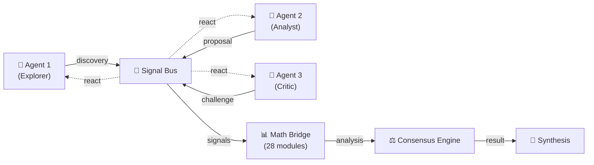
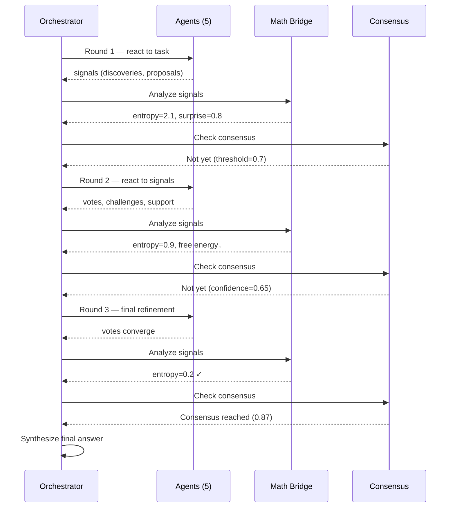
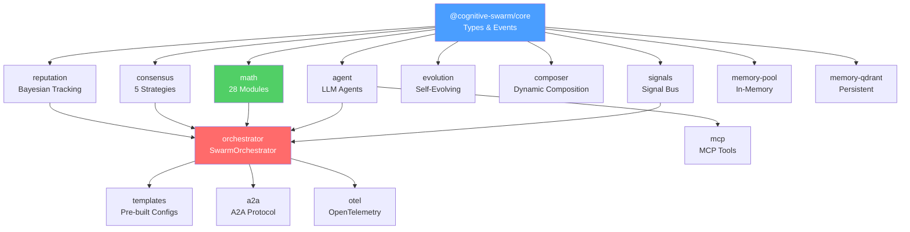

<div class="vp-doc" style="padding: 0 24px;">

## What is cognitive-swarm?

**cognitive-swarm** is an open-source TypeScript framework for building multi-agent LLM systems that communicate through signals, reach consensus through formal algorithms, and optimize behavior using computational mathematics.

Unlike pipeline-based frameworks (CrewAI, LangGraph) where agents follow a script, cognitive-swarm agents **react to signals** — discoveries, proposals, doubts, challenges, votes. Behavior emerges from interaction, not orchestration.

### Key Differentiators

<div class="features-grid">

**Signal-Based Architecture** — Agents communicate via typed signals (discovery, proposal, challenge, vote, doubt, conflict) on a shared bus. No hardcoded conversation flows.

**28 Math Modules** — Shannon entropy decides when to stop, not a round limit. Free energy guides exploration. Game theory makes challenging suspicious consensus mathematically optimal. Bayesian inference, causal inference, Shapley values, optimal transport, and 22 more — all pure TypeScript, zero LLM calls.

**5 Consensus Strategies** — Confidence-weighted, Bayesian, entropy-based, hierarchical, and voting. Dissent is preserved in the result, not discarded.

**Self-Evolving Swarms** — Agents detect expertise gaps and vote to spawn new specialists. The swarm grows and prunes itself over time.

**Production-Ready Resilience** — Exponential backoff retry, circuit breaker, token budget, and resumable checkpoints out of the box.

**Full Observability** — OpenTelemetry integration with 20 span types covering every event. Plug into Jaeger, Zipkin, Datadog, or any OTel-compatible backend.

**Protocol Interop** — Expose any swarm as an [A2A](https://google.github.io/A2A/) agent via HTTP. Give agents external tools via [MCP](https://modelcontextprotocol.io/) servers.

**Thompson Sampling** — Agents adaptively select strategies (analyze, propose, challenge, support, synthesize, defer) using Thompson Sampling bandit. The swarm learns which approaches work per context.

</div>

## How It Works

### Signal-Based Deliberation



### Solve Loop

Each `solve()` runs iterative rounds until math says to stop:



### Package Architecture



## Quick Example

```typescript
import { SwarmOrchestrator } from '@cognitive-swarm/orchestrator'
import { researchTemplate } from '@cognitive-swarm/templates'

const swarm = new SwarmOrchestrator({
  ...researchTemplate({ engine }),
  maxRounds: 5,
  consensus: { strategy: 'confidence-weighted', threshold: 0.7 },
  tokenBudget: 10_000,
})

const result = await swarm.solve('Should we use microservices or a monolith?')

console.log(result.answer)       // Synthesized answer from all agents
console.log(result.confidence)   // 0.87
console.log(result.consensus)    // Full voting record, dissent preserved
console.log(result.cost)         // { tokens: 4200, estimatedUsd: 0.006 }
```

## Use the Math Standalone

`@cognitive-swarm/math` works independently — 28 computational math modules with no LLM dependency:

```typescript
import { shannonEntropy, klDivergence, ParticleSwarm, MarkovChain } from '@cognitive-swarm/math'

// Information theory
const H = shannonEntropy([0.3, 0.3, 0.2, 0.2])  // 1.97 bits

// Swarm optimization
const pso = new ParticleSwarm(3)
pso.addParticle('a1', [0.1, 0.5, 0.8])
pso.step()

// Markov chain convergence prediction
const chain = new MarkovChain()
chain.observe('exploring')
chain.observe('converging')
const prediction = chain.predict()
```

[See all 28 modules →](/packages/math)

## 20 Packages

| Category | Packages |
|----------|----------|
| **Core** | [core](/packages/core), [orchestrator](/packages/orchestrator), [agent](/packages/agent), [signals](/packages/signals), [consensus](/packages/consensus), [math](/packages/math) |
| **Composition** | [composer](/packages/composer), [evolution](/packages/evolution), [evaluation](/packages/evaluation), [reputation](/packages/reputation), [introspection](/packages/introspection), [templates](/packages/templates) |
| **Memory** | [memory-pool](/packages/memory-pool), [memory-qdrant](/packages/memory-qdrant) |
| **Integrations** | [otel](/packages/otel), [mcp](/packages/mcp), [a2a](/packages/a2a), [tools-web-fetch](/packages/tools-web-fetch), [tools-web-search](/packages/tools-web-search) |
| **Testing** | [benchmarks](/packages/benchmarks) |

## Cost

5 agents × 3 rounds with GPT-4o-mini ≈ **$0.006 per solve**. Math analysis (28 modules) adds $0.000 — it's pure CPU computation.

## License

Apache-2.0 — [View on GitHub](https://github.com/medonomator/cognitive-swarm)

</div>
